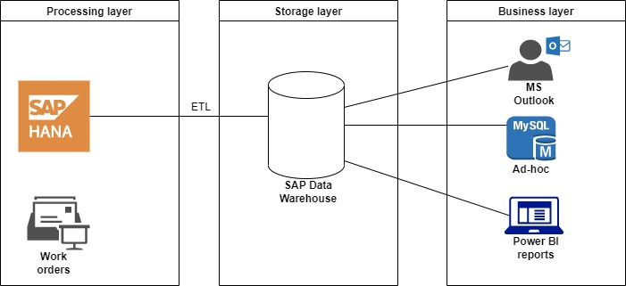
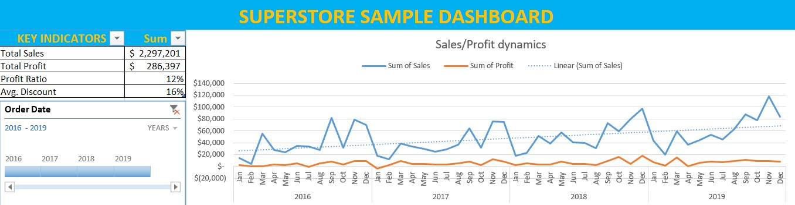
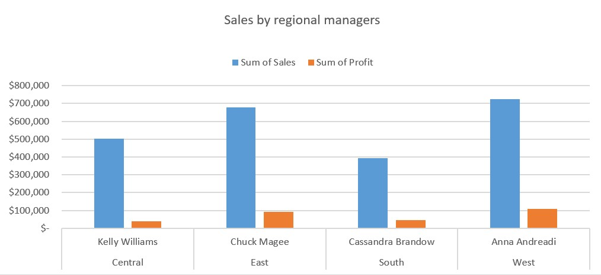
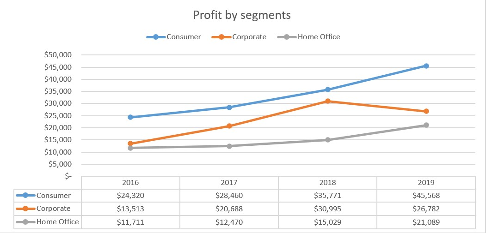
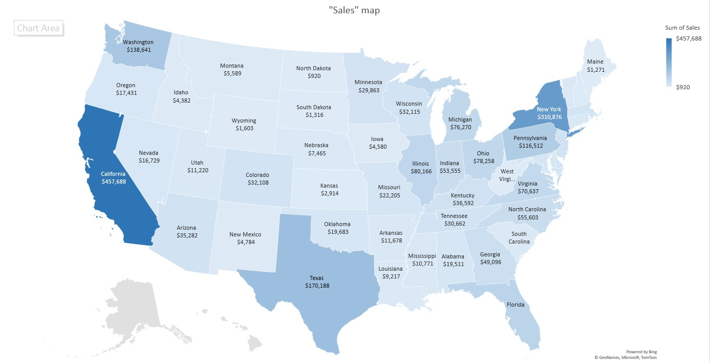
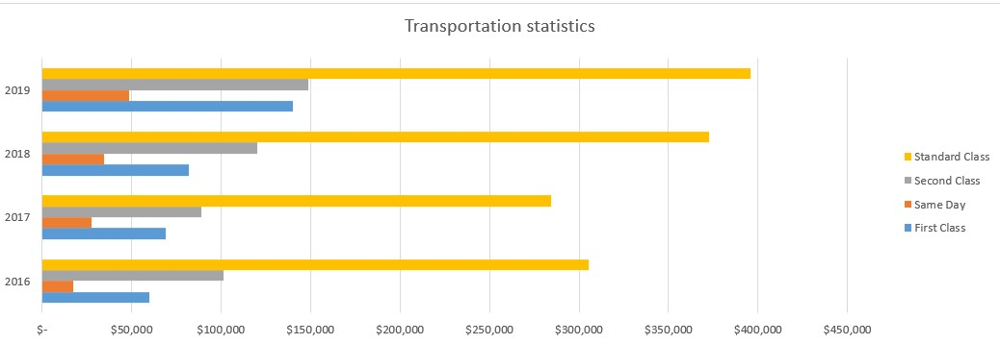
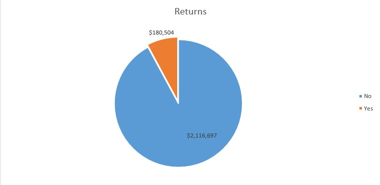

## Task 1: 
##### To draw top-level architecture of the analytical solution for any random company

## Solution:
##### This is the example of a production company **processing** data as per requirements from its equipment (typical work orders), then *extracting*, *transforming* and *loading* with a **storage** it in business information warehouse. **Business** users could request required information through reporting sources. 

## Task 2:
##### To create a dashboard on sample report using pivot tables and Excel formulas 

To create a dashboard on sample report using pivot tables and Excel formulas

## Solution:
##### [Sample - Superstore - Maha's solution](https://view.officeapps.live.com/op/view.aspx?src=https%3A%2F%2Fraw.githubusercontent.com%2Foctopuswantssomesleep%2FDatalearn%2Fmain%2FDE-101%2FModule01%2FSample%2520-%2520Superstore%2520-%2520Maha.xlsx&wdOrigin=BROWSELINK)

